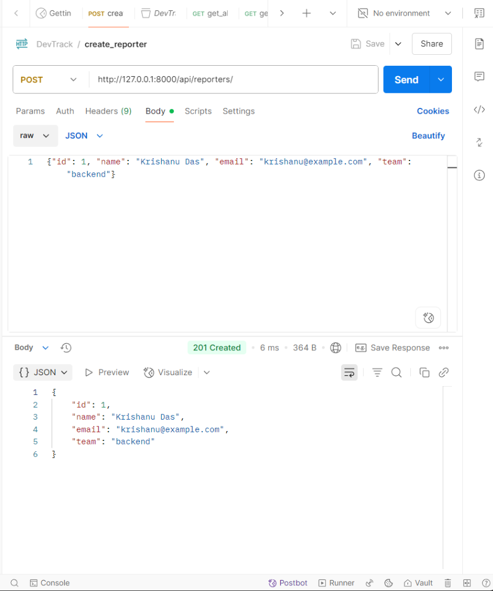
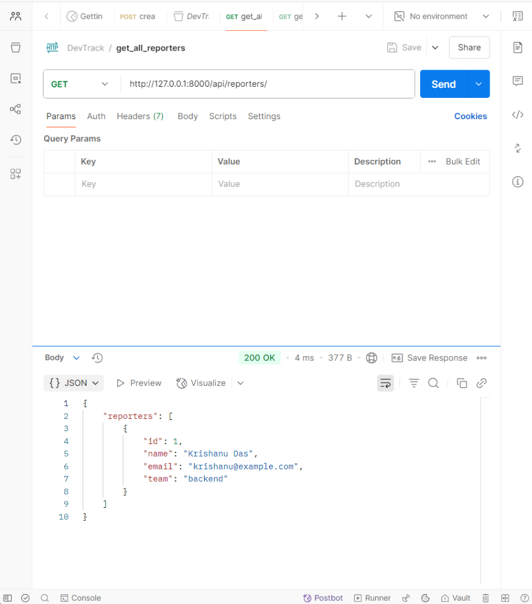
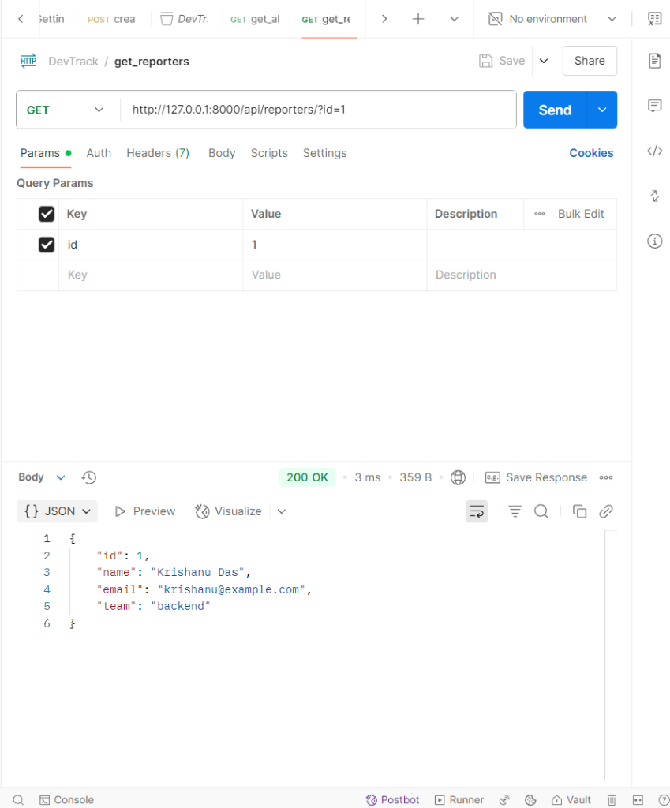
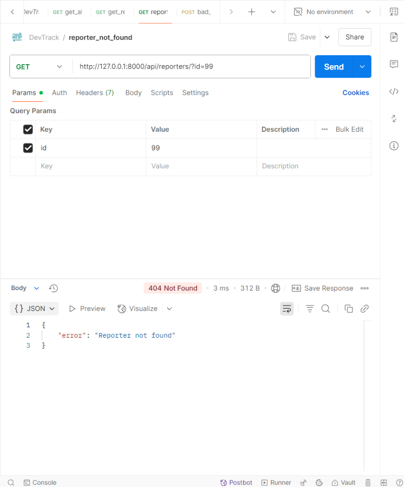

# DevTrack

A minimal backend API for tracking engineering issues, built with Django for the
Airtribe backend assignment. Engineers (reporters) file issues, each with a priority
and a status, similar to a stripped-down GitHub Issues.

## How to run

```bash
python -m venv .venv
.venv\Scripts\activate          # macOS/Linux: source .venv/bin/activate
pip install -r requirements.txt
python manage.py runserver
```

The API is then available at `http://127.0.0.1:8000/api/`.

## Endpoints

| Method | URL | What it does |
|---|---|---|
| POST | `/api/reporters/` | Create a reporter (201), or 400 if a field is missing or invalid |
| GET | `/api/reporters/` | List all reporters |
| GET | `/api/reporters/?id=1` | Get one reporter, or 404 if it doesn't exist |
| POST | `/api/issues/` | Create an issue (201). The response includes a `message` from `describe()`, which differs by priority |
| GET | `/api/issues/` | List all issues |
| GET | `/api/issues/?id=1` | Get one issue, or 404 if it doesn't exist |
| GET | `/api/issues/?status=open` | List only issues with the given status |

Errors are returned as JSON: `{"error": "..."}`. POSTing an id that already exists returns 400.

### Example: create an issue

Request: `POST /api/issues/`

```json
{
  "id": 1,
  "title": "Login button not working on mobile",
  "description": "Users on iOS 17 cannot tap the login button",
  "status": "open",
  "priority": "critical",
  "reporter_id": 1
}
```

Response: `201 Created`, with the stored fields plus
`"message": "[URGENT] Login button not working on mobile — needs immediate attention"`.

## Project structure

| File | Responsibility |
|---|---|
| `issues/models.py` | Plain Python OOP classes: `BaseEntity` (abstract, with `validate()` and `to_dict()`), `Reporter`, `Issue`, and the priority subclasses `CriticalIssue` and `LowPriorityIssue` |
| `issues/storage.py` | Reading and writing the JSON files |
| `issues/views.py` | HTTP endpoints: parse the request, validate through the model classes, store, respond |
| `issues/urls.py`, `devtrack/urls.py` | URL routing (`/api/` is routed to the `issues` app) |
| `issues.json`, `reporters.json` | The stored data |

### How the OOP fits together

- `BaseEntity` is an abstract base class. Every entity must implement `validate()`,
  and every entity gets `to_dict()` for free.
- `Issue.validate()` checks that the title isn't empty and that status and priority
  are among the allowed values, which are defined once as class constants.
- `CriticalIssue` and `LowPriorityIssue` override only `describe()`. When an issue is
  created, the view picks the class from the priority (`critical`, `low`, or the
  base `Issue` for `medium` and `high`) and calls `describe()` without needing to know
  which class it has.

## Design decision: file storage lives in its own module

All reading and writing of `issues.json` and `reporters.json` goes through two
functions in `issues/storage.py`, `read_records()` and `write_records()`. The views
never open files directly.

The alternative was to open and parse the JSON files inside each view, which is
shorter at first but repeats the same file-handling code in every endpoint. Keeping
it in one place means each layer has a single job: the model classes validate data,
the storage module persists it, and the views only connect HTTP requests to those
two. It also means that replacing JSON files with a real database later would only
change `storage.py`; the models and views would stay the same. It also handles the
first run cleanly, returning an empty list when a file doesn't exist yet, so no
endpoint needs its own check for that.

## Postman screenshots





